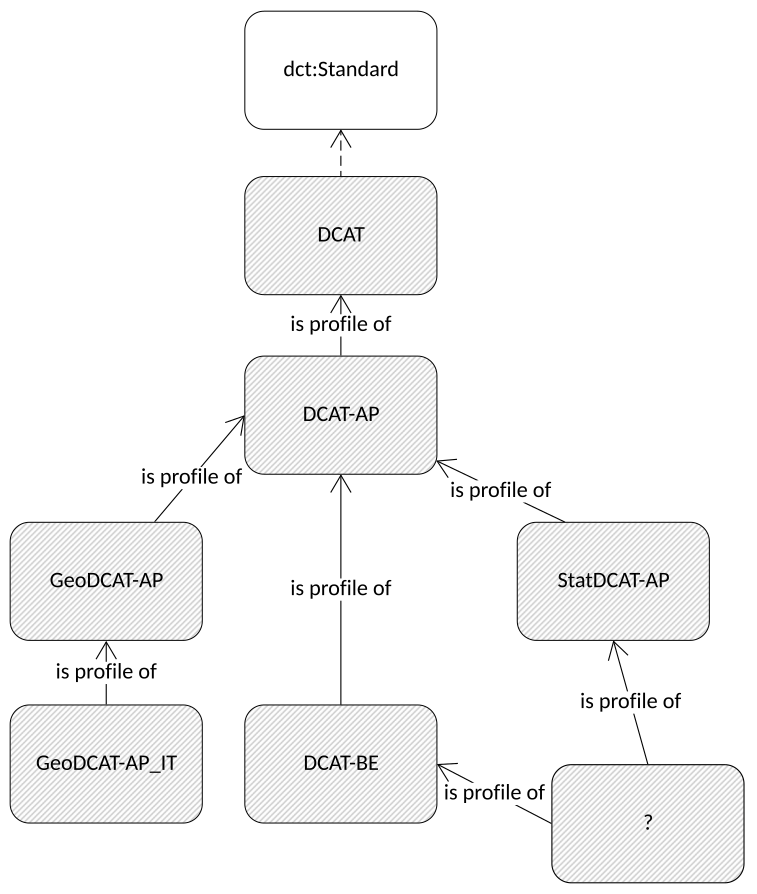

# DEMETER implementation

Primarily this repository explores the use of and best practice (e.g. JSON-LD) to introduce a layer of semantic interoperability into DEMETER implementations.

## Assumptions:
There will always be a tension between simple application-specific data models and more general ones capable of integrating data from multiple sources.

At some level there is always a generic model that applies, but its optimal use may be harder to understand.

Simple sensor streams will choose trivial data models where it is expected clients understand much of the contextual metadata.


## Key points about JSON-LD
1. JSON-LD is just JSON, including extra annotation possibilities.
1. JSON-LD can use (and re-use) __context_ files that hold all the details so API implementers only need to reference the semantic annotation for the standard they are using.
1. JSON-LD is actually a form of RDF - so its easy to combine JSON-LD data with other semantic data published in RDF (using standard data models) to create rich information models out of very simple JSON payloads. 
1. Adding JSON-LD allows __many, simple__ JSON schemas to be used for different purposes, but data integration to be driven by the RDF model of how these schemas fir a bigger picture. (The "have your cake and eat it too").
1. JSON-LD can co-exist with JSON-schema to both define a structure and explain what it means.
1. languages like SHACL can be be used over the RDF view of JSON-LD data to validate content as well as structure.


## Challenges
### Completeness of "contexts"
Declaration of "context" - i.e. mapping of schema elements to URIs - gets complex for a domain. Consider the Fiware context: https://fiware.github.io/data-models/context.jsonld
 
this contains some 1890 terms including 

```
telephone: "https://uri.fiware.org/ns/data-models#telephone",
temperature: "https://uri.fiware.org/ns/data-models#temperature",
surfPracticeArea: "https://uri.fiware.org/ns/data-models#surfPracticeArea",
wheelieBin: "https://uri.fiware.org/ns/data-models#wheelieBin",
wheels: "https://uri.fiware.org/ns/data-models#wheels",
```

clearly this cannot cover all possible semantics, but the list terms is already huge and can never be complete and be stable in a real world context. This cannot reasonably be maintained and governed with so many domains that are possibly covered.  

In general one-size-fits-all schemas, contexts, data models cannot be both specific enough to be useful and complete.

### Ad-hoc schemas
JSON-LD itself doesnt restrict what information is available, and may not restrict subtleties - such as "temperature" as a property - let us imagine that as temperature of an object, or the ambient temperature of the environment or the temperature of the sensor itself - and then factor in instantaneous or averaged, max, min etc... Clearly it is going to be hard to interpret details of semantics from just a schema - even if we have detailed descriptions of elements.

Often the actual use case is a set of information which together represents a characterisation of something for a particular purpose - for example Air Quality measurement according to an EU standard...

So, to build a full picture it probably necessary to know: schema, which elements mean which, and how the data itself fits into a wider data set context (for what purpose it is sampled.) - What JSON-LD does is allow us to :
1. identify commonalities between schemas and data sets
1. link data to available explanations
1. link data elements to metadata that enables us to process it further

JSON-schema allows us to make sure all necessary elements are present...

The additional metadata about the nature of the dataset will still need to be captured - so if schemas are "ad-hoc" - i.e. every API creates some arbitrary schema, then there will be a large burden on publishers to publish a lot of information and on users to read this, and then on developers to configure clients to cope with each schema. (This is the default state DEMETER is attempting to improve on)


### Re-use of generic models and schemas
Generalised models and schemas can be re-used, but each application will need to specify how specific datasets should be expressed - what terms to use, what optional elements should be present etc.

These constraints on how to use a general purpose mechanism in a consistent way for a specific purpose are called profiles. Profiles allow identification of the data design to attach metadata about the semantics of content related to sampling stratgies for example - but they can also be used to describe general patterns that sub-profiles can apply.

Although this is not widespread practice amongst API developers, profiles are become common in metadata standards e.g. [https://www.w3.org/TR/vocab-dcat-2/#profiles] and can be applied to all data. Profiles can also be modelled in terms of how they interoperate with each other:



DCAT profiles example.
(Source: https://www.w3.org/TR/dx-prof/)

### Interoperability levels

Interoperability concerns appear at multiple aspects of system design, to meet  different stakeholders' requirements for example:
1) Services (client software)
2) Data format - availability of libraries: (server and client software)
3) Data set metadata (client software, end user, publishing)
4) Schemas - (specialised client software, general client software configuration - identification of role of different elements)
5) Semantic object identification (URI) - comparison with known objects to identify meaning
6) Semantic description - URI dereferencing to get semantic resources (end users - get descriptions, publishers - minimise documentation, client software - minimise overhead of collating descriptions, data integration and processing - accessing machine actionable metadata)
7) profiles - get a statement about the overall meaning of data (data integration and aggregation, publishers, developers, users - minimise overheads with extensive ad-hoc documentation generation and consumption)

## Recommendations
1. Identify interoperability requirements and create (i.e. publish at a stable URI) profiles that deliver JSON context documents (if mime-type is ld+json) and JSON schema (if mime-type is json)
1. Identify semantic resource requirements for each interoperability user case and declare the canonical data models for such resources in "super-profiles" of specific use cases to converge on common and sustainable designs. 

e.g. a profile for FIWare/NGSI-LD interoperability, OGC API etc - allows us to both test and share interoperability design across multiple activities.


## Issues
### caching

Reusable JSON-LD contexts can be cached, so the extra cost of having more contexts to read is actually saved by not having to fetch unique but repetitive contexts. This does mean things ought to be set up sensibly on both server and client.

see: http://manu.sporny.org/2016/json-ld-context-caching/

### governance and stability

Contexts should be factored according to expectations about scope and stakeholder.
If the authority for a set of definitions publishes a stable, canonical context, this should be used by preference to make interoperability expectations clear. (this will also help caching).

NB. OGC can provide a service to make contexts with broad applicability to standards available on a permanent basis, and also publish project-specific prototypes. Such profiles can accessed by identifying URIs and be semantically annotated within OGC's Linked Data infrastructure. 

### tooling and publishing

some experimentation and consultation is required around optimum approached to context negotiation.

For testing purposes JSON-Ld contexts should be named X_content.jsonld and bundled with examples.

when published, the context should be referenced by the name of the profile (which is technology neutral) and accessed by using appropriate content-negotiation.

RDFLIB json-ld plug-in correctly requests the correct mime type when dereferencing URLS:

``'application/ld+json, application/json;p=0.9, */*;q=0.1'``

So a profile like "http://www.opengis.net/def/profiles/baseline"  would return JSON-LD context to a tool like this - but HTML to a standard web browser, and OWL to a RDF client accessing via owl:imports. 


## Examples

test.jsonld is an example that references a common DEMETER content, which in turns references a sample "OGC semantic baseline" context. 

The OGC will publish a context which will:
* reference standard ontologies and namespaces used in OGC published semantic resources
* include namespaces for OGC published ontologies (and the W3C standards they use) (geosparql, time, rdfs)

a stub for this is in ogc_core_context.jsonld

the test.py script can be run to generate the equivalent test.ttl version.


