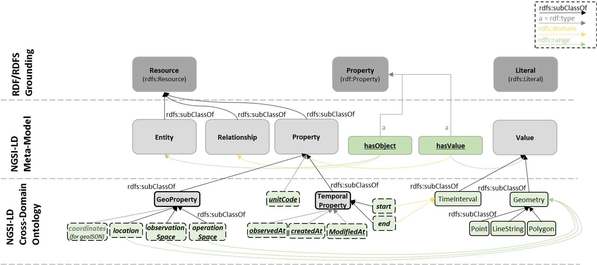

# DEMETER AIM considerations

In line with best practices and recommendations, the specification of DEMETER AIM will follow a modular approach in a layered architecture, enabling among others:
1.  eased interoperability with existing models by reusing available (well-scoped) models in the modules, instead of defining new terms, whenever possible
1.  easy mapping/alignment with other models, by module instead of the whole model
1.  easy extension of the domain/areas covered in AIM with additional modules
1.  easy extension of domain model, by modifying only specific modules
1.  easy mapping to top-level/cross-domain ontologies 

# NGSI-LD considerations

The NGSI-LD Information Model is defined at three levels.
At the higher level, there are the foundation classes which correspond to the Core Meta-model and the Cross-Domain Ontology (see Figure below).  The former concerns the formal specification of the "property graph" model [i.6]. The latter includes is a set of generic, transversal classes which are aimed at avoiding conflicting or redundant definitions of the same classes in each of the domain-specific ontologies. Below these two levels, domain specific ontologies or vocabularies are devised.

NGSI-LD uses JSON-LD as main serialisation format, which provides the key advantage that terms can be defined in a separate document, referenced by an @context statement. In particular, the The @context in JSON-LD is used to map terms provided as strings to concepts specified as URIs. 

The meta-model solution in NGSI-LD is based on blank node reification, which is “especially convenient when the graph is serialized with JSON-LD because blank nodes do not explicitly appear in the textual serialized description, and actually show up only when it is represented as an RDF graph. It is thus possible for a developer to generate the JSON-LD payload of an API in a form that is very similar to what he would have generated in plain JSON.”

# NGSI-LD meta-model

According to the specification, the NGSI-LD meta-model provides a formal basis for representing "property graphs" using RDF/RDFS/OWL. It makes it possible to perform back and forth conversion between datasets based on the property graph model on the one hand and linked data datasets which rely on the RDF framework, on the other hand. This may be seen as raising the semantic expressivity of RDF triples to the level of property graphs. Property graphs may, contrary to RDF, use predicates as subjects of other predicates (properties of properties and properties of relationships).

# The NGSI-LD @context
The Core NGSI-LD (JSON-LD)[@context](https://uri.etsi.org/ngsi-ld/v1/ngsi-ld-core-context.jsonld) is defined as a JSON-LD @context which contains:

* The core terms needed to represent the key concepts defined by the NGSI LD Information Model, including the meta-model and cross-ontology
* The terms needed to represent all the members that define the API-related Data Types

# Insights

NGSI-LD approach is well founded, following a layered architecture and based on the increasingly popular JSON-LD serialisation format. Conceptually, it enables the good sides of two “worlds”: the benefits of linked data and underlying RDF-based reasoning tools and querying (enabling data integration, knowledge discovery, etc.) ,  and the richer expressivity of property graphs (using predicates as subjects of other predicates). 

The issues or challenges we highlight are more on the implementation of this approach. 
* The current NGSI-LD context is just a simple flat schema that includes the meta-model and cross ontology terms without any explicit semantics.  There is no definition that a term is a class, a property or information about the property types, constraints on domains/ranges, cardinality, taxonomic relations, or other axioms. 
* The terms are not mapped to any standard and/or well-known ontologies/vocabularies. There is some documentation dicussing some of such mappings; however, no implementation seems to be available to allow any integration. In fact, it is not clear, how such mappings would be implemented from documentation reviewed. 
* The flat schema implementation approach is not scalable, and difficult to maintain.
* The only semantic information available is in fact included in the encoding of data itself, and is just minimal (e.g., an element is a property or a relationship)

As a result, many advantages of the linked data and underlying RDF-based reasoning tools and querying cannot be easily or directly  exploited, e.g., (automatic) data link discovery (integration), (automatic) model alignment for data integration, validation of conformance of data with the model with a simple reasoner, inferencing on the data to discover new knowledge, specialisations (taxonomy) with inheritance of axioms. 

